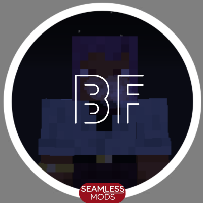
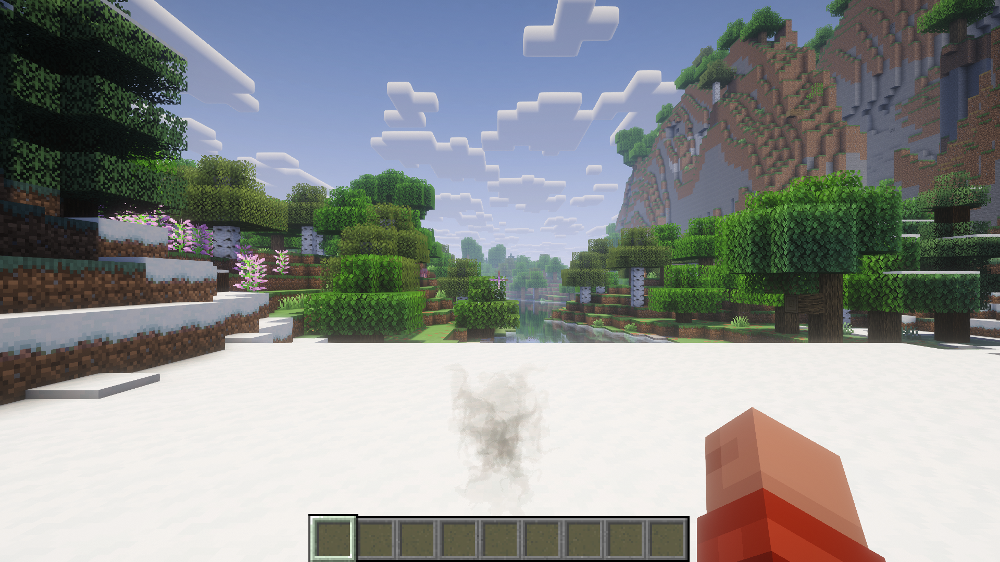
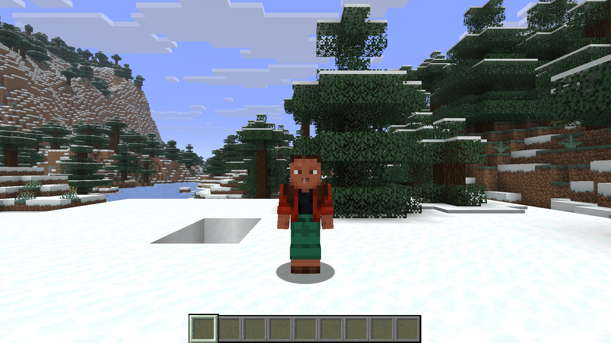

# Breath Fog

Client-only cold-biome breath vapor, with soft and pixelated styles on the maintained Minecraft version branches below. Each branch contains its supported loaders, source, build instructions, screenshots and acceptance report.

## Minecraft version branches

| Minecraft | Maintained loaders | Source |
| --- | --- | --- |
| 26.3 | Fabric, Forge, NeoForge | [26.3](https://github.com/DerkOttersberg/breath-fog/tree/26.3) |
| 1.21.1 | Fabric, Forge, NeoForge | [1.21.1](https://github.com/DerkOttersberg/breath-fog/tree/1.21.1) |
| 1.20.1 | Fabric, Forge | [1.20.1](https://github.com/DerkOttersberg/breath-fog/tree/1.20.1) |
| 26.2 | Historical Fabric MVP | [26.2](https://github.com/DerkOttersberg/breath-fog/tree/26.2) |

The maintained branches default to pixelated breath in fresh configs and include a saved **Pixelated Minecraft style** toggle for choosing soft vapor. Existing explicit style choices are preserved. Each Minecraft version keeps its supported loaders together. Use its own installation instructions, dependency pins, and TESTING.txt; binaries are specific to that version. Quilt is outside the maintained support matrix.

This default branch preserves the original 26.2 Fabric MVP and its historical evidence. Open a maintained version branch above for the completed multi-loader implementation and pixel option.

## Install a maintained version

Open the matching version branch above and follow its installation/build instructions. Current artifacts use `breath-fog-1.0.1+mc<version>-<loader>.jar`; install one matching runtime JAR and its declared dependencies. Each maintained branch records the tested loader pins, pixelated default, icon and exact acceptance evidence.

The existing GitHub release below belongs to the historical 26.2 MVP.

## Historical 26.2 install

Download the installable JAR from [Releases](https://github.com/DerkOttersberg/breath-fog/releases). This is an MVP test build: [TESTING.txt](TESTING.txt) records the completed checks and remaining acceptance work.

1. Use Minecraft **26.2**, Java **25**, and Fabric Loader **0.19.3** or a compatible newer loader.
2. Put **Fabric API 0.159.0+26.2** and `breath-fog-0.1.0+mc26.2-fabric.jar` in that profile's `mods` folder.
3. Visit a cold biome or run `/breathfog preview` for a 20-second local preview.
4. Open `/breathfog config` to adjust visibility and intensity. Mod Menu is optional.

Only the viewer needs this mod. Servers and other players require no installation. Breath timing is independently simulated by each viewer. The mod sends no packets, registers no particle types, changes no gameplay, and stores no world data.

The packaged mod contains the original vapor sprites and icon. No external resource pack is needed. Resource packs can replace the namespaced textures through normal Minecraft resource loading.

## Actual game captures

First person with Complementary Reimagined r5.9.3 enabled:

Third person with shaders disabled:

These are captures from the packaged JAR. Bright backgrounds and shader settings affect contrast. A direct rear view can hide the early plume behind the player's head. Shader-specific limits and the measured eight-emitter performance results are in [TESTING.txt](TESTING.txt).

## Build

Windows: run `powershell -ExecutionPolicy Bypass -File .\build.ps1`. It obtains a checksum-verified Temurin Java 25 toolchain inside `.toolchains` and changes `JAVA_HOME` only for this build. It does not change installed system Java. The first build needs internet access.

With Java 25 already selected, run `./gradlew clean check build` (or `gradlew.bat` on Windows). Output: `fabric/build/libs/breath-fog-0.1.0+mc26.2-fabric.jar`.

`./gradlew :fabric:runClient` launches a development client. `-Pqa :fabric:runClient` opts into the development instrumentation in `fabric/src/qa`, in a separate `fabric/run-qa` profile. This optional run expects a test save named `New World`. QA code never enters the distributable JAR.

## Settings

`config/breath_fog.json` is saved atomically. Edit it while the game is closed, or use the in-game screen. Invalid JSON is preserved and defaults are used with a log message. Unknown fields are ignored for forward compatibility.

| Setting | Default | Meaning |
| --- | --- | --- |
| `enabled` | `true` | Master switch |
| `firstPerson` | `true` | Your first-person breath |
| `thirdPerson` | `true` | Your breath in either third-person view |
| `nearbyPlayers` | `true` | Other players within 32 blocks |
| `intensity` | `1.0` | Density multiplier, 0.10–2.00 |
| `firstPersonIntensity` | `1.0` | First-person multiplier, 0.10–1.50 |

Cold means biome base temperature below `0.5`, or the conventional `c:is_cold` biome tag. Exposure blends over ten ticks; sampling adds up to ten ticks of detection latency. Indoors uses the same biome rule. Dead, sleeping, invisible, spectating, or submerged players do not emit. Preview respects these suppression rules and visibility settings.

Idle breaths start every 3.2–4.8 seconds, or 2.2–3.2 while sprinting. Seven ticks of emission form a layered plume. Wisps live 18–26 ticks, expand, rotate slightly, rise, collide, and dissolve. Procedural curl and a bounded eight-player wake field supply the fluid-like movement; this is a lightweight visual approximation, without background refraction.

## Compatibility and limits

Rendering uses vanilla `SingleQuadParticle`, the lit translucent quad layer, and normal depth testing. No renderer mixins, core-shader replacements, custom framebuffer effects, or Architectury API runtime dependency are included. Iris can render the same particle submission path. See the delivered test report for exact configurations actually exercised; shader-pack lighting, particle ordering, and translucency settings can change the appearance.

At most 24 nearest emitters and 256 live owned particles are tracked. Distance and Minecraft's particle setting reduce emission. Render interpolation smooths the 20 Hz simulation. Vanilla's particle alpha cutoff can remove the faintest parts of a dissolving wisp. The conservative first-person view-cone fade intentionally keeps the crosshair clear.

See [PORTING.md](PORTING.md) for the reusable foundation, [ARCHITECTURE.md](ARCHITECTURE.md) for implementation boundaries, and [art/ASSETS.md](art/ASSETS.md) for original asset provenance. Code is released under CC0; the settings-screen foundation is adapted from Seamless Crafting's CC0 source.
